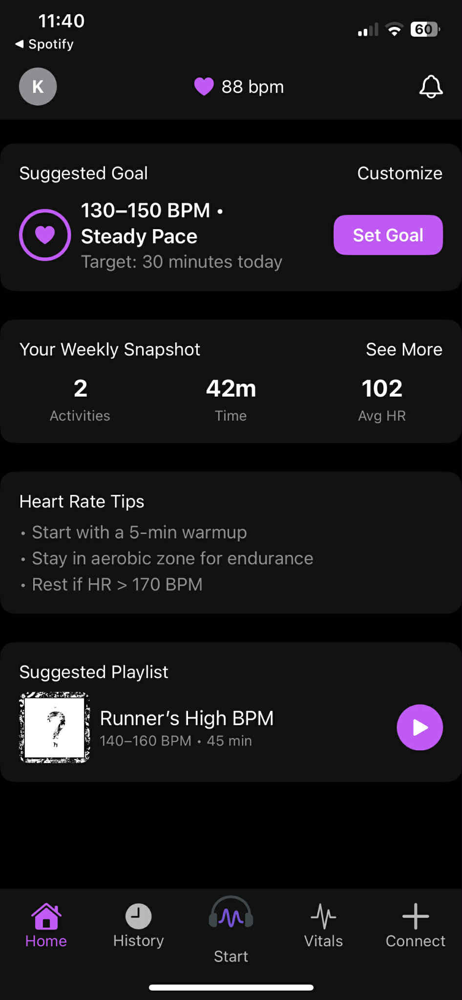
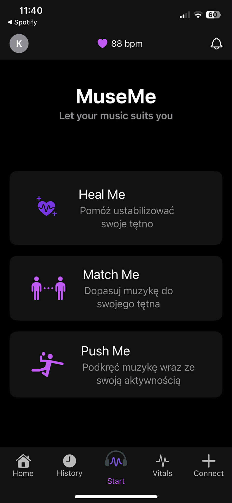
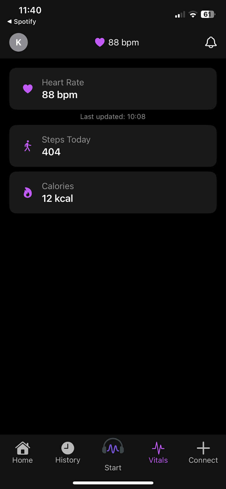
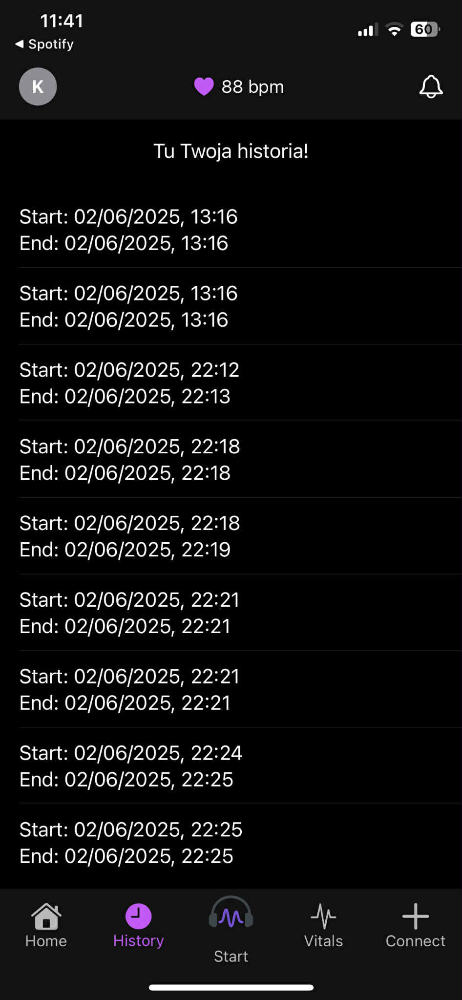

# MuseMe 🎵

> *Let your music suit you*

An iOS app that adapts music playback to your real-time heart rate — built as an engineering thesis project.
Connect your Apple Watch, choose a mode, and let the music follow your body.

---

## How it works

MuseMe reads your heart rate via **HealthKit** and adjusts music tempo accordingly through **Spotify / Apple Music / SoundCloud** integration.

### Modes

| Mode | Description |
|---|---|
| **Heal Me** | Slows music down to help stabilize an elevated heart rate |
| **Match Me** | Matches music BPM to your current heart rate and maintains it |
| **Push Me** | Gradually increases music tempo to push your heart rate up |

---

## Features

- Real-time heart rate monitoring via Apple Watch + HealthKit
- Spotify, Apple Music & SoundCloud integration
- Three adaptive playback modes
- Weekly activity snapshot (activities, time, avg HR)
- Suggested goals based on HR data
- Session history tracking
- Vitals dashboard (HR, steps, calories)

---

## Screenshots

  
  
  
  

---

## Tech Stack

- **Swift / SwiftUI** — UI and app architecture
- **HealthKit** — heart rate, steps, calories from Apple Watch
- **Spotify SDK / Apple Music API / SoundCloud API** — music playback
- **AVFoundation** — audio tempo manipulation
- **WatchConnectivity** — iPhone ↔ Apple Watch communication

---

## Requirements

- iOS 16+
- Apple Watch (for real-time HR)
- Spotify / Apple Music / SoundCloud account

---

## Status

Engineering thesis project — Silesian University of Technology, 2025.
Active development.

---

## Author

**Błażej Faber** · [LinkedIn](https://www.linkedin.com/in/blazejfaber/) · [blazej.faber@gmail.com](mailto:blazej.faber@gmail.com)
